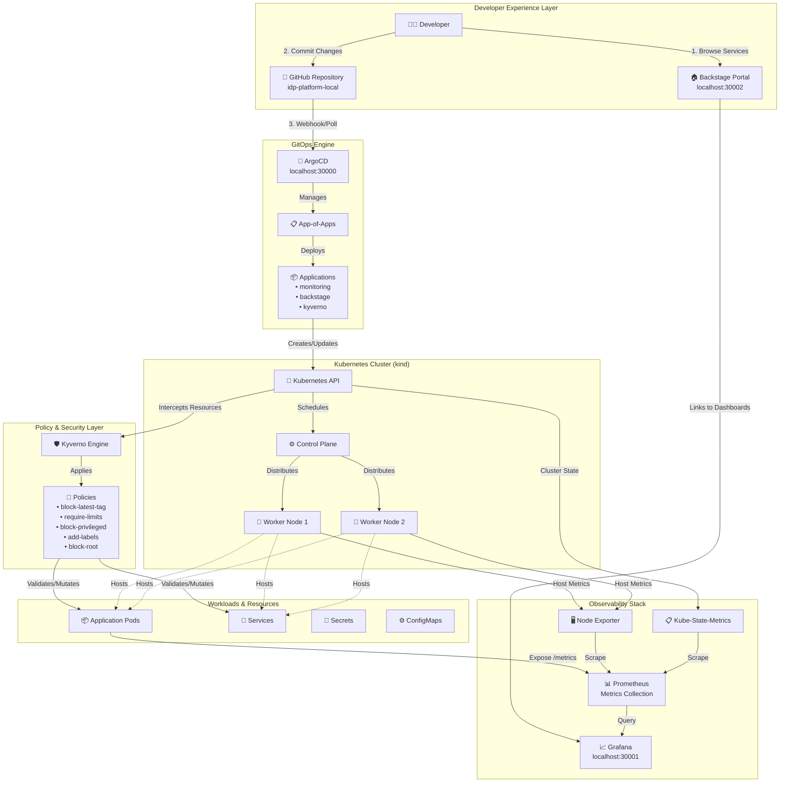
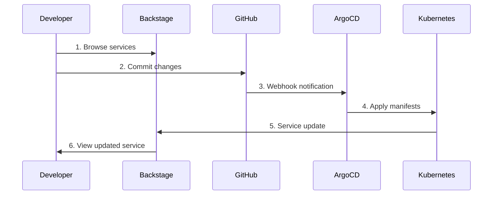
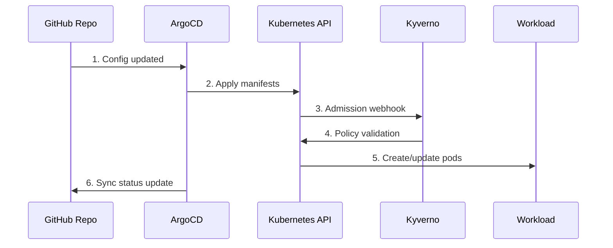
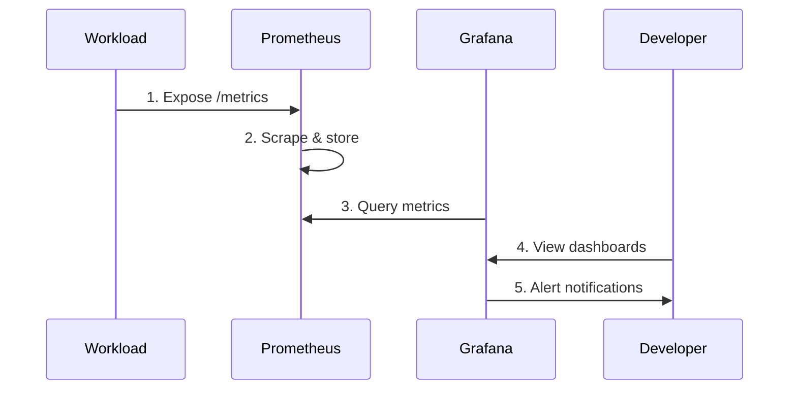
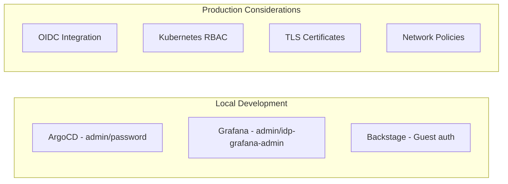

# IDP Platform Architecture

> **Visual representation of the Internal Developer Platform components and their interactions**

## Architecture Diagram



## Data Flow Patterns

### 1. **Developer Workflow**


### 2. **GitOps Deployment Flow**


### 3. **Observability Data Flow**


## Component Integration Matrix

| Component    | Depends On              | Provides To             | Communication Method |
|--------------|-------------------------|-------------------------|---------------------|
| **kind**     | Docker                  | All components          | Kubernetes API      |
| **ArgoCD**   | Kubernetes, Git         | All deployments         | kubectl, Git API    |
| **Prometheus** | Kubernetes            | Grafana                 | HTTP scraping       |
| **Grafana**  | Prometheus              | Developers              | HTTP queries        |
| **Backstage** | Kubernetes, Git        | Developers              | REST APIs           |
| **Kyverno**  | Kubernetes              | All workloads           | Admission webhooks  |

## Network Architecture

### Port Mappings
- **30000** → ArgoCD UI (admin interface)
- **30001** → Grafana UI (metrics visualization)
- **30002** → Backstage UI (developer portal)

### Internal Service Communication
- **ArgoCD** communicates with GitHub via polling (30s interval)
- **Prometheus** scrapes metrics from all pods with `/metrics` endpoint
- **Kyverno** intercepts API calls via admission controllers
- **Backstage** discovers services via Kubernetes API

### Data Persistence
- **Prometheus**: Ephemeral (7-day retention, no PVC)
- **Grafana**: Ephemeral (dashboards from ConfigMaps)
- **ArgoCD**: Ephemeral (Git as source of truth)
- **Backstage**: Ephemeral (bundled PostgreSQL, reset on restart)

## Security Architecture

### Authentication & Authorization


### Policy Enforcement Points
1. **Admission Control** → Kyverno policies at Kubernetes API
2. **Resource Validation** → Required labels, limits, security contexts
3. **Mutation** → Auto-add labels and default configurations
4. **Audit** → Policy violation logging and reporting

## Scaling Considerations

### Horizontal Scaling
- **ArgoCD**: Multi-replica for HA
- **Prometheus**: Federation for multi-cluster
- **Grafana**: LoadBalancer with shared storage
- **Kyverno**: Multiple admission controllers

### Vertical Scaling
- **Memory**: Increase for large clusters (>100 nodes)
- **CPU**: Scale based on workload deployment frequency
- **Storage**: persistent volumes for long-term metric retention

### Multi-Environment Strategy
```
Development (kind) → Staging (EKS/GKE) → Production (Multi-AZ)
     ↓                    ↓                    ↓
Single-node          3-node cluster      Multi-zone cluster
Ephemeral storage    Short-term PVCs     Long-term storage
Guest auth           Basic RBAC          Full OIDC + RBAC
```

## Disaster Recovery

### Backup Strategy
- **Git repository** → Source of truth (GitHub backup/mirror)
- **Prometheus data** → Export/snapshot for long-term storage
- **Grafana dashboards** → Stored as code in ConfigMaps
- **Kyverno policies** → Git-managed ClusterPolicy YAML

### Recovery Procedures
1. **Cluster failure**: `kind delete cluster && make bootstrap`
2. **ArgoCD failure**: Redeploy via Helm, sync restores all apps
3. **Data loss**: Git provides declarative restoration
4. **Partial failure**: ArgoCD self-heal restores drift

---

This architecture demonstrates production-ready platform engineering patterns that scale from local development to enterprise deployments.